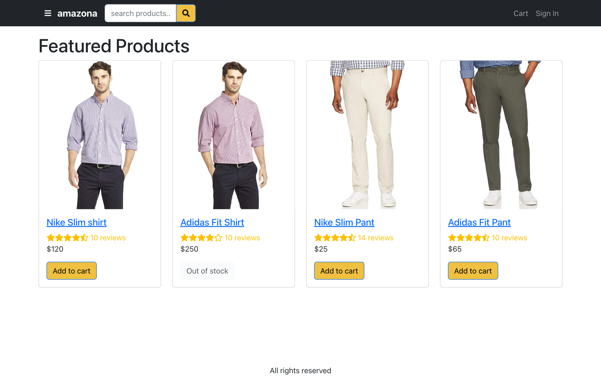
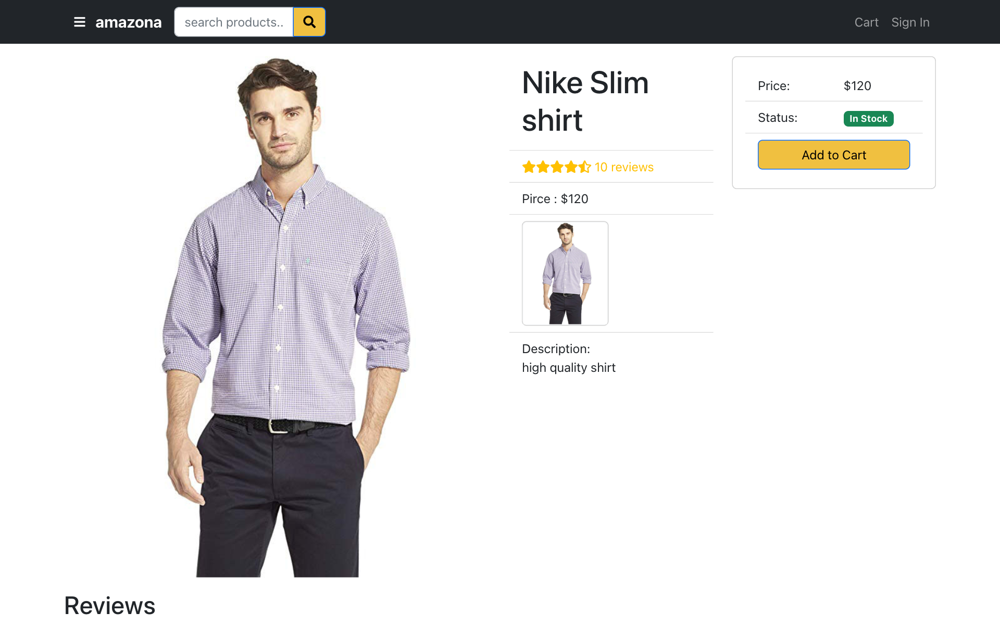
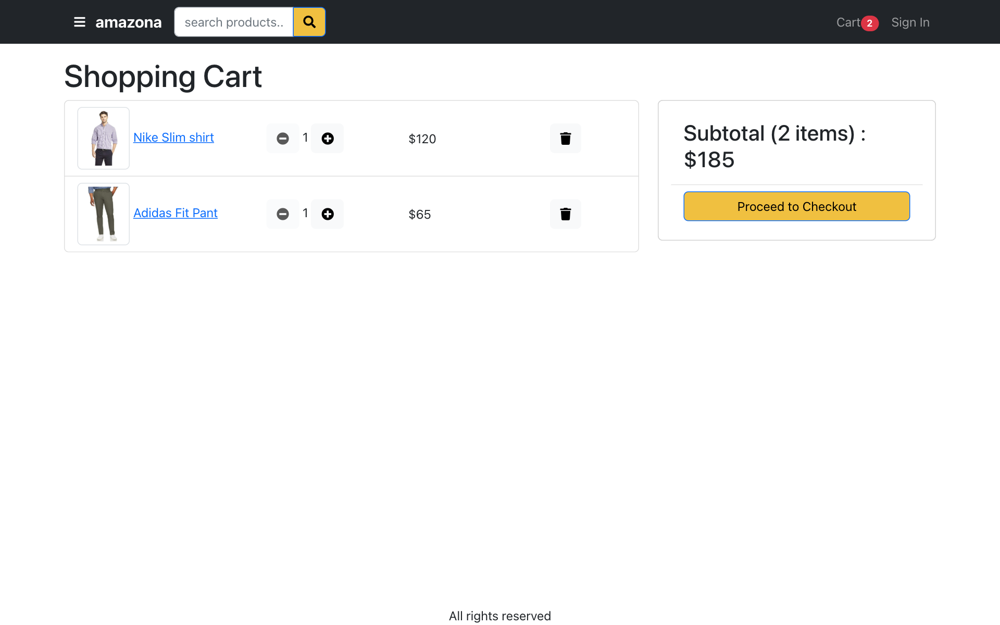
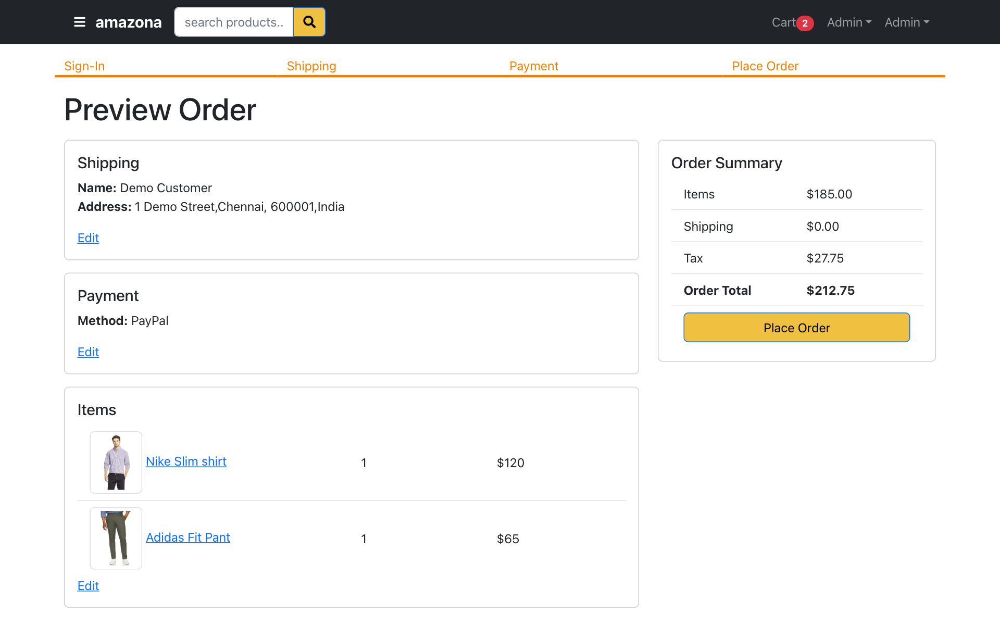
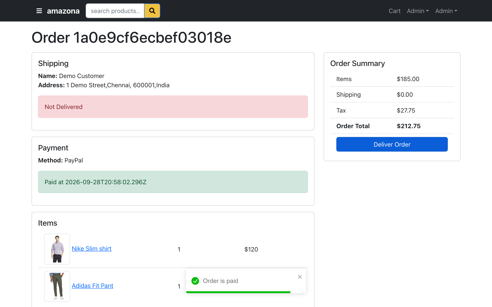
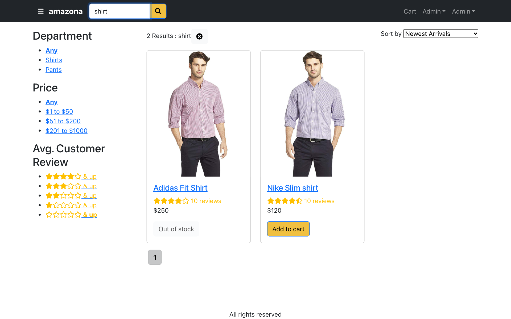
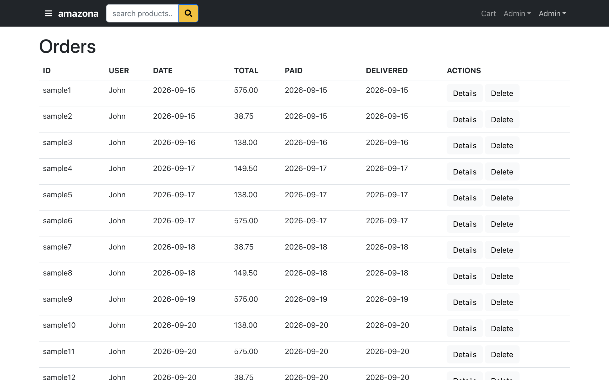
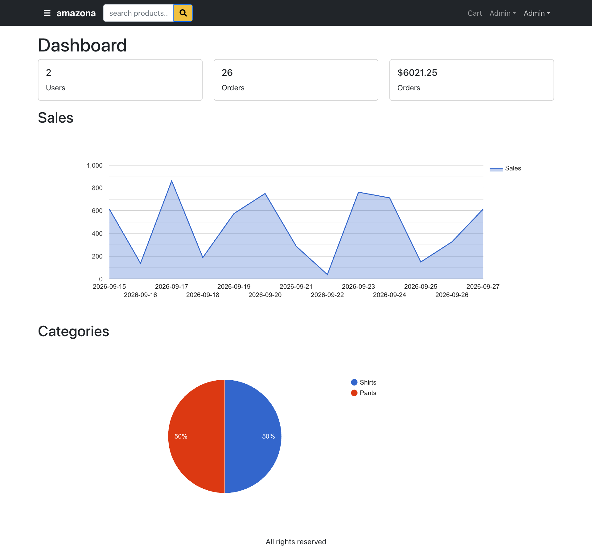

# Amazona — MERN Stack E-Commerce Store

[](https://s-harshni.github.io/Amazon-Clone-MernStack/)


<!-- live-links -->
> 🔗 **Live demo:** [s-harshni.github.io/Amazon-Clone-MernStack](https://s-harshni.github.io/Amazon-Clone-MernStack/)  
> 🔑 **Demo login:** `user@example.com` / `123456` (admin: `admin@example.com` / `123456`). Demo data is stored in your browser only.  
> 👤 **Portfolio:** [s-harshni.github.io/S-Harshni](https://s-harshni.github.io/S-Harshni/)  
<!-- live-links -->

A full-stack, Amazon-style online store built with the **MERN** stack (MongoDB, Express, React, Node.js). Shoppers can search and filter products, manage a cart, check out and pay. Admins manage products, orders and users from a dashboard with sales analytics.



## Features

**Shopping**
- Product catalogue with ratings, stock status and product detail pages
- Search with department, price-range and rating filters, sorting and pagination
- Persistent cart (quantity updates, stock checks)
- Four-step checkout: sign-in → shipping (optional Google Maps location) → payment method → place order
- PayPal payments (sandbox), order history and order-detail pages
- Product reviews and ratings

**Accounts**
- Sign-up / sign-in with **JWT** authentication and **bcrypt** password hashing
- Profile editing, forgot/reset password by email (Mailgun)

**Admin**
- Dashboard: user/order/revenue totals, daily sales chart and category breakdown (Google Charts, MongoDB aggregation)
- Product management (create, edit, delete, image upload to Cloudinary)
- Order management (mark delivered, delete) and user management (roles, delete)

## Screenshots

| Product page | Cart |
|---|---|
|  |  |

| Checkout: place order | Order paid |
|---|---|
|  |  |

| Search & filters | Admin: orders |
|---|---|
|  |  |

**Admin dashboard**



## Tech stack

| Layer | Technologies |
|---|---|
| Frontend | React 18, React Router 6, React-Bootstrap, Context API + `useReducer` state, Axios, React Toastify, React Helmet |
| Backend | Node.js, Express, `express-async-handler`, JWT auth middleware |
| Database | MongoDB with Mongoose models (users, products, orders) and aggregation pipelines |
| Integrations | PayPal (`@paypal/react-paypal-js`), Google Maps, Cloudinary (image upload), Mailgun (email) |
| Hosting | GitHub Pages via GitHub Actions (static demo build) |

## How the live demo works

GitHub Pages can only host static files, so the Pages build (`REACT_APP_DEMO=true`) swaps the Express/MongoDB API for an in-browser implementation of the same routes ([`frontend/src/demoApi.js`](frontend/src/demoApi.js)). Data lives in each visitor's `localStorage`: sign-in, cart, checkout, reviews and all admin screens work. The demo is seeded with sample products and two weeks of **sample orders** so the dashboard has data. PayPal is replaced with a "Pay Now (demo)" button. The real backend in `backend/` is unchanged; run it locally to use MongoDB.

## Run locally (full stack)

Requirements: Node.js 18+ and a MongoDB connection string (MongoDB Atlas free tier works).

```bash
git clone https://github.com/S-Harshni/Amazon-Clone-MernStack.git
cd Amazon-Clone-MernStack

# backend
cd backend && npm install
cat > .env <<'ENV'
MONGODB_URI=mongodb+srv://<user>:<password>@<cluster>/amazona
JWT_SECRET=change-me
PAYPAL_CLIENT_ID=sb
ENV
npm start                          # API on http://localhost:4000

# frontend (new terminal)
cd ../frontend && npm install
npm start                          # http://localhost:3000 (proxies /api to :4000)
```

Seed sample data by visiting `http://localhost:4000/api/seed`. Optional variables: `GOOGLE_API_KEY`, `CLOUDINARY_*`, `MAILGUN_API_KEY`, `MAILGUN_DOMIAN`.

## Project structure

```
backend/
  models/        Mongoose schemas: User, Product, Order
  routes/        REST API: /api/products, /api/users, /api/orders, /api/upload, /api/seed
  utils.js       JWT sign/verify, admin guard, email templates
  server.js      Express app, serves the React build in production
frontend/
  src/screens/   21 pages: home, product, search, cart, checkout steps, orders, admin
  src/Store.js   global cart/user state (Context + reducer)
  src/demoApi.js in-browser API used only by the GitHub Pages demo
.github/workflows/deploy.yml   builds and publishes the demo
```

## API overview

| Method | Endpoint | Description |
|---|---|---|
| GET | `/api/products` · `/api/products/search` · `/api/products/slug/:slug` | Catalogue, filtered search, product detail |
| POST | `/api/products/:id/reviews` | Add a review (auth) |
| POST | `/api/users/signin` · `/api/users/signup` | Authentication (returns JWT) |
| PUT | `/api/users/profile` | Update profile (auth) |
| POST | `/api/orders` | Create order (auth) |
| PUT | `/api/orders/:id/pay` · `/api/orders/:id/deliver` | Payment / delivery status |
| GET | `/api/orders/summary` | Dashboard aggregates (admin) |

## Credits

Built by following Basir Jafarzadeh's MERN Amazona course ([basir/mern-amazona](https://github.com/basir/mern-amazona)). This repository adds a static in-browser demo API with seeded sample data, GitHub Pages deployment and documentation.

## Author

**S Harshni** · [Portfolio](https://s-harshni.github.io/S-Harshni/) · [LinkedIn](https://www.linkedin.com/in/ks-harshni/) · [GitHub](https://github.com/S-Harshni)
